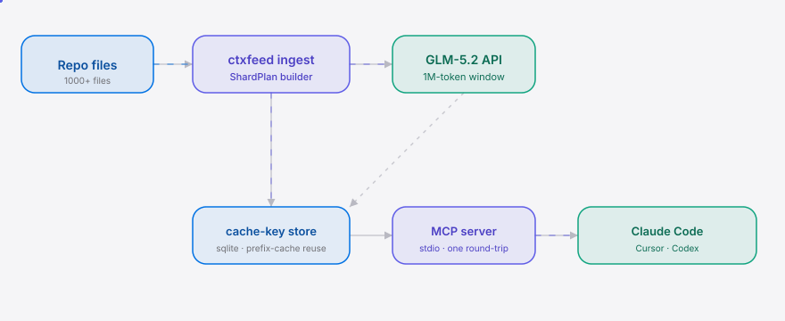

<div align="right"><sub>[English](./README.en.md) | <b>简体中文</b></sub></div>

<picture>
  <source media="(prefers-color-scheme: dark)" srcset="./assets/hero-dark.svg">
  <source media="(prefers-color-scheme: light)" srcset="./assets/hero-light.svg">
  
</picture>

<p><sub>面向 Agent 的本地 MCP 项目上下文后端：把整个仓库按缓存感知顺序切片塞进 GLM-5.2 的 100 万 token 窗口，Claude Code / Cursor / Codex 一次调用查 1000+ 文件，绕过 ChatGPT 的 40 文件上限，单次查询成本低于 Opus。</sub></p>

<p align="center">
  <a href="./LICENSE"></a>
  <a href="https://github.com/SuperMarioYL/ctxfeed/releases"></a>
  
  
  
</p>

**一句钩子**：ChatGPT 把项目卡在 40 个文件、Claude 的 200k 窗口按 token 计费烧到撞限额——ctxfeed 把整个 1000+ 文件仓库塞进 GLM-5.2 的 1M 上下文喂给 coding agent，一次 MCP 往返拿到答案。

<h2> 架构</h2>

<picture>
  <source media="(prefers-color-scheme: dark)" srcset="./assets/atlas-dark.svg">
  <source media="(prefers-color-scheme: light)" srcset="./assets/atlas-light.svg">
  
</picture>

核心原语是 **ShardPlan**——缓存感知的文件摄入顺序，让 ctxfeed 不只是"调 GLM 带文件"。`stable_prefix`（依赖清单、README、类型定义先入）+ `delta`（只重摄入改动文件）是可拥有的部分：一个确定性的、prefix-cache 对齐的摄入计划，原始 GLM/DeepSeek API 不提供。没有它，判词说产品会退化成"成本套利 RAG 包装"。

## 为什么是现在

GLM-5.2 的 1M MIT 许可上下文窗口是 2026 年的已发布实物（[r/LocalLLaMA](https://www.reddit.com/r/LocalLLaMA/comments/1uwe542/) 引述"Kimi K3 in the next few hours. DeepSeek V4 GA later in the week"——多家 CN 长上下文模型同周落地），MCP 给了 coding agent 一个标准摄入缝。ctxfeed 把这波供给侧长上下文变成 Agent 能直接消费的项目上下文后端——[langgenius/dify](https://github.com/langgenius/dify) 这类国产 origin 的 agent 平台生态正是它的落地点：dify 用户撞到上下文上限时，ctxfeed 是那个喂全仓库的 MCP 后端。

<h2> 快速开始</h2>

```bash
uvx ctxfeed init            # 扫描仓库、构建 ShardPlan、摄入（默认 dry-run，无需 key）
uvx ctxfeed cost            # 单次查询 token 成本对比 Opus
```

进 live 模式（真实 GLM-5.2 调用）：

```bash
export ZHIPU_API_KEY=glm-...
uvx ctxfeed init            # 真 GLM-5.2 摄入
```

<details><summary>sample output（dry-run）</summary>

```
╭──────────────────────────────────────────────────────────╮
│ ctxfeed init — /path/to/repo                            │
│ model=GLM-5.2 (1M ctx)  mode=dry-run                   │
╰──────────────────────────────────────────────────────────╯
┌─────────────────────┬────────────────────────────┐
│ files accepted      │ 1024  (vs ChatGPT's 40)    │
│ stable_prefix       │ 12  (3_421t)               │
│ repo_body           │ 1012  (118_733t)           │
│ tokens              │ 122,154 / 1,000,000 (12.2%)│
│ cache hit           │ 0%                         │
│ delta (new/changed) │ 1024                       │
└─────────────────────┴────────────────────────────┘
╭──────────────────────────────────────────────────────────╮
│ 1024 files accepted  (25.6x ChatGPT's cap, PAST)        │
╰──────────────────────────────────────────────────────────╯
```
</details>

<h2> 用法</h2>

```bash
# 查看某文件/目录加进 plan 后的 layer + token 数（只读，不改缓存）
uvx ctxfeed add ./src/auth.py

# 起 stdio MCP server，给 Claude Code / Cursor / Codex 消费
uvx ctxfeed mcp --repo /path/to/repo

# 在 Claude Code 里注册：
claude mcp add ctxfeed -- uvx ctxfeed mcp --repo /path/to/repo
```

注册后，在 Claude Code 里问"auth middleware 在哪？"——ctxfeed 把全仓库摄入 GLM-5.2 的 1M 窗口，一次 MCP 往返返回带文件路径引用的答案。MCP 暴露三个工具：

| 工具 | 作用 |
|---|---|
| `query_repo(question)` | 全仓库入上下文 + 一次调用回答问题 |
| `list_files()` | 列出会被摄入的文件 + layer + 缓存状态 |
| `cost_delta()` | 单次查询 token 成本 vs Opus |

编程式 API：

```python
from ctxfeed.cache_plan import CachePlan

with CachePlan.for_repo("/path/to/repo") as cp:
    plan = cp.plan()                       # 缓存感知 ShardPlan
    qr = cp.query("auth middleware 在哪？")  # 全仓库一次往返
    delta = cp.cost_delta()                # vs Opus 的成本差
print(qr.answer, delta.savings_ratio_glm)
```

<h2> Demo</h2>


10 分钟从 `git clone` 到首屏可见结果：`uvx ctxfeed init` → `uvx ctxfeed cost`，看到两个"可星标"数字——文件数（1000+ vs 40）和单次成本 vs Opus。

<h2> 配置</h2>

| 环境变量 / 配置 | 类型 | 默认 | 含义 |
|---|---|---|---|
| `ZHIPU_API_KEY` | str | `""` | GLM-5.2 API key（空 → dry-run 模式） |
| `GLM_API_KEY` | str | `""` | 别名，回退读 `ZHIPU_API_KEY` |
| `CTXFEED_REPO_ROOT` | str | — | MCP server 的仓库根（也可 `--repo` 传） |
| `IngestConfig.window` | int | `1_000_000` | GLM-5.2 上下文窗口 |
| `IngestConfig.max_file_bytes` | int | `262144` | 跳过大于此值的文件 |
| `IngestConfig.cache_db` | str | `.ctxfeed/cache.db` | SQLite 缓存键库路径 |

<h2> 路线图</h2>

- [x] **m1 ingest benchmark** — 1000 文件摄入 GLM-5.2 1M 窗口 + repo-QA 对 200k-RAG 基线 kill-check
- [x] **m2 shard + MCP** — 缓存感知 `ShardPlan` + stdio MCP server（`query_repo` / `list_files`）
- [x] **m3 ship CLI** — `uvx ctxfeed init/add/cost` + 成本差 dashboard
- [ ] 多供应商成本兜底（Kimi K3 / GLM 5.5 config stub）
- [ ] ECC 级 agent-harness 集成 PR（dify / ECC 把 ctxfeed 作为 MCP 项目上下文后端）

### vs ChatGPT Projects / Claude Code 200k 窗口

| 维度 | ctxfeed (GLM-5.2 1M) | ChatGPT Projects | Claude Code 200k |
|---|:---:|:---:|:---:|
| 文件上限 | ✓ 1000+ | ✗ 40 | 部分（按 token 截断） |
| 单次查询成本 | ✓ CN 长上下文定价 | — 套餐 | ✗ US per-token |
| prefix-cache 折扣 | ✓ DeepSeek V4 兜底 | — | ✗ |
| MCP 原生接入 agent | ✓ stdio | ✗ | 部分 |
| 企业合规/数据驻留 | ✗（CN 路由是硬停） | ✓ | ✓ |

企业合规买家不在目标内——CN 路由对他们是硬停，不是偏好（mvp_plan §6 out of scope）。

## 分享

```
ctxfeed — 把整个 1000+ 文件仓库塞进 GLM-5.2 的 1M token 窗口，喂给 coding agent 的 MCP 项目上下文后端。绕过 ChatGPT 的 40 文件上限，单次成本低于 Opus。https://github.com/SuperMarioYL/ctxfeed
```

## License + 贡献

MIT — 见 [LICENSE](./LICENSE)。提 issue 或 PR：[github.com/SuperMarioYL/ctxfeed/issues](https://github.com/SuperMarioYL/ctxfeed/issues)。

<p align="center"><sub><a href="./LICENSE">MIT</a> © 2026 SuperMarioYL</sub></p>
